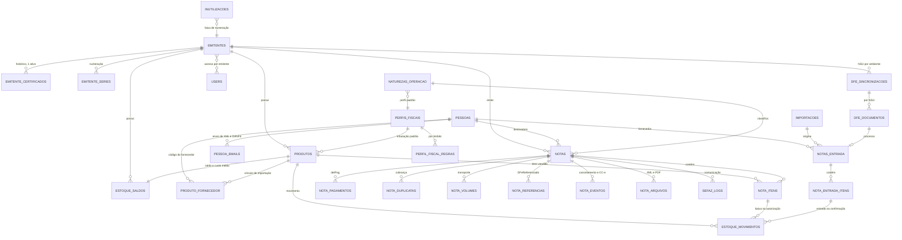
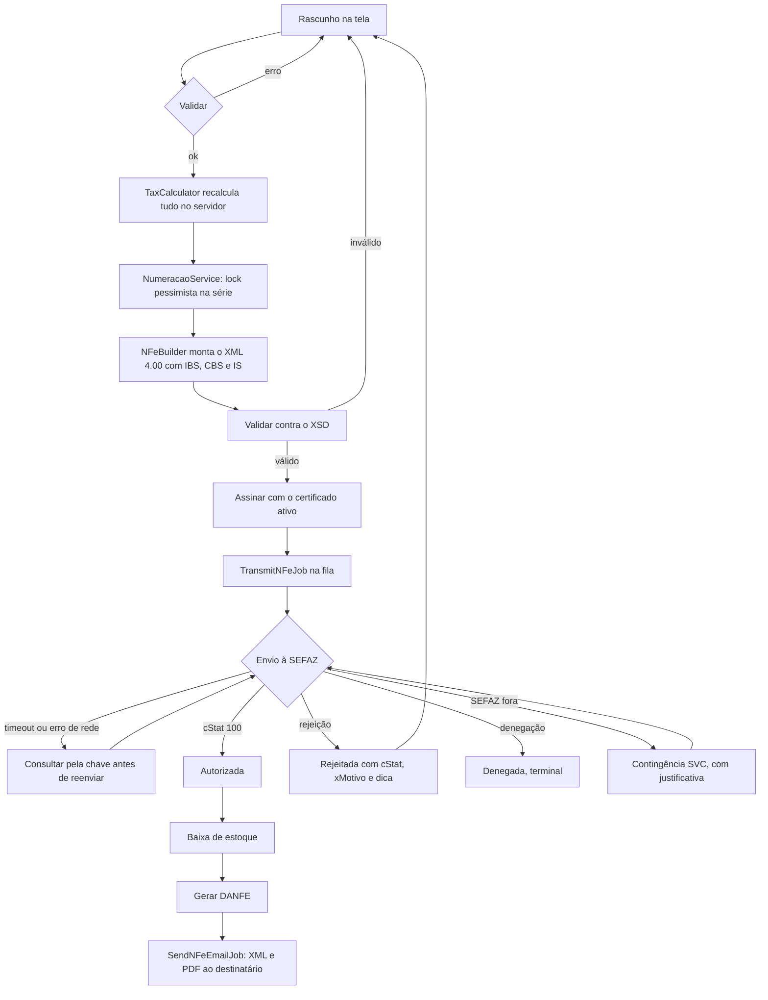
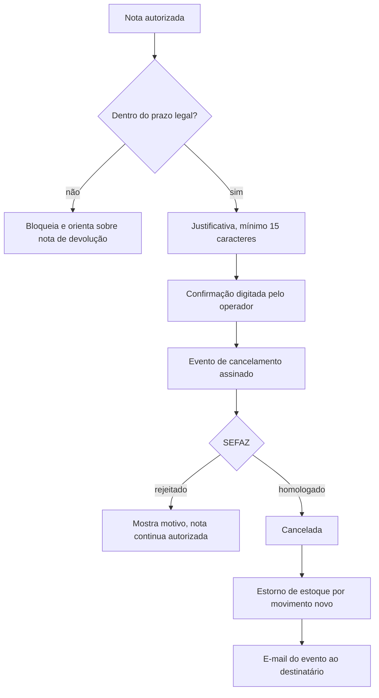
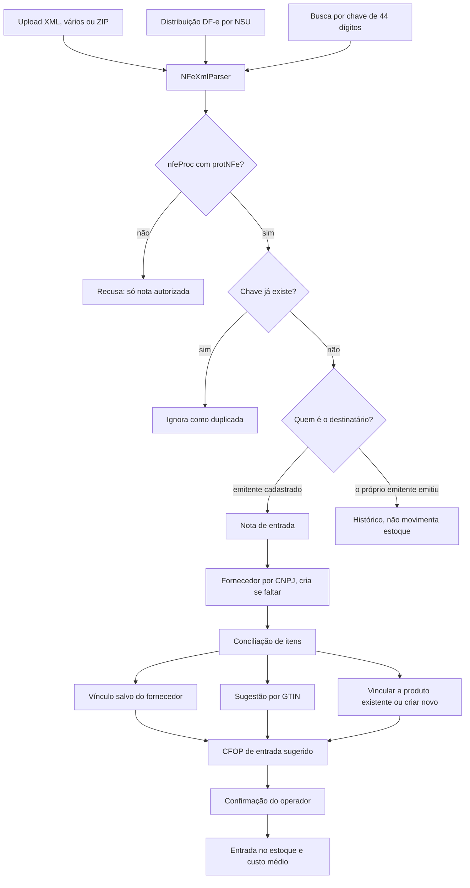
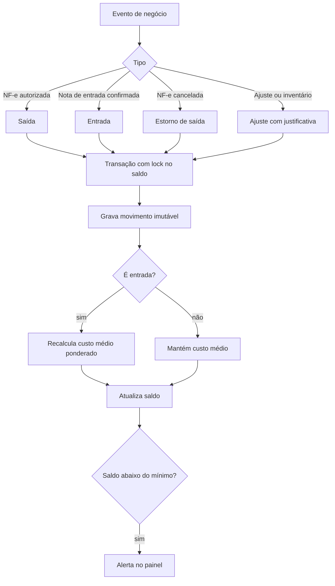

# Arquitetura do emissor-nfe

> Fase 2. Escrito em 2026-09-10.
> Base de referência: `docs/analise-app-transm.md`. Regras fiscais em `docs/decisoes-fiscais.md`.

## 1. Stack final

| Camada | Escolha | Divergência do `app-transm` |
|---|---|---|
| PHP | `^8.3` | Referência usa `^8.2`. A máquina roda 8.4.19 |
| Framework | Laravel 13.x | Referência usa 12.63. O `processo-comercial` já roda 13.17, então a versão é conhecida na casa |
| Banco | **MySQL 8** | Igual. A referência é MySQL/MariaDB, confirmado pelas migrations com `MODIFY COLUMN ... ENUM` |
| Front | **Livewire 3** + Alpine 3 + Tailwind 4 | **Diverge.** A referência é Blade puro |
| Fiscal | `nfephp-org/sped-nfe ^5.2.8`, `sped-common`, `sped-da` com versão fixa | Referência usa `sped-da` em `dev-master` |
| Permissões | **`spatie/laravel-permission`** | **Diverge.** A referência usa helper próprio de 269 linhas |
| Filas | `database`, com worker gerenciado | Referência drena por cron, por limitação da hospedagem |
| Storage | **S3 privado obrigatório** | Referência usa disco local |
| Testes | Pest 3 | Igual |
| Lint | Laravel Pint | Igual |
| Deploy | Laravel Cloud | Referência é hospedagem compartilhada |

### Por que Livewire, contrariando a referência

A tela de emissão é o oposto de um formulário estático. Ela recalcula tributos a cada mudança de item, quantidade, desconto ou destinatário; adiciona e remove linhas; rateia frete e seguro proporcionalmente; consulta saldo de estoque; e busca produto por código, descrição ou GTIN. Em Blade puro isso vira algumas centenas de linhas de JavaScript manual mantendo um espelho do estado do servidor.

O risco fiscal decide a questão: **todo total precisa ser recalculado no backend**, porque um imposto calculado no navegador é um imposto que o operador pode adulterar. Com Livewire o cálculo já vive no servidor por construção, e o `TaxCalculator` é o mesmo objeto na tela e na transmissão. Em Blade puro haveria duas implementações do mesmo cálculo, e a divergência entre elas seria questão de tempo.

Custo aceito: menor familiaridade entre os dois sistemas.

### Por que `spatie/laravel-permission`, contrariando a referência

São quatro perfis (Administrador, Faturamento, Estoque, Consulta) e o acesso é **por emitente**, não global. O recurso de *teams* do pacote mapeia diretamente para multiemitente, com o `emitente_id` como team key. O helper de 269 linhas da referência não cobre isso, não é testado por terceiros e teria que ser reescrito de qualquer forma.

## 2. Modelo de dados

### Diagrama de entidades



### Decisão: uma tabela `pessoas`, não três

O escopo pede cadastro de cliente, fornecedor e transportadora, com a mesma estrutura e as mesmas integrações. Três tabelas duplicariam CNPJ, endereço, IE e as chamadas de ReceitaWS e ViaCEP.

Uma metalúrgica que compra peça microfundida da RCM e vende liga metálica para ela é **cliente e fornecedor ao mesmo tempo**. Com três tabelas, esse CNPJ vira dois cadastros que divergem no primeiro endereço atualizado.

**Decisão:** uma tabela `pessoas` com os papéis como flags (`e_cliente`, `e_fornecedor`, `e_transportadora`), e três telas filtradas por papel. O operador enxerga os três cadastros que o escopo pede, e o dado do CNPJ existe uma vez só.

### Grupos de tabelas

**Base e acesso**

| Tabela | Papel |
|---|---|
| `users` | Usuários |
| `roles`, `permissions`, `model_has_roles`, `model_has_permissions`, `role_has_permissions` | Spatie, com `emitente_id` como team key |
| `emitente_user` | Vínculo de acesso por emitente |
| `audit_logs` | Quem, o quê, quando, IP, valores antes e depois |

**Tabelas oficiais** (seeders e comandos de atualização)

`ufs`, `municipios` (IBGE), `cfops`, `ncms`, `cests`, `cst_icms`, `csosn`, `cst_ipi`, `cst_pis`, `cst_cofins`, `unidades_medida`, `meios_pagamento` (tPag), `classificacoes_tributarias` (cClassTrib, RTC), `aliquotas_icms_uf` (alíquota interna por UF, base do DIFAL), `cfop_entrada_saida` (conversão configurável para importação).

Comandos Artisan de atualização: `fiscal:atualizar-ncm` e `fiscal:atualizar-cclasstrib`, ambos a partir das fontes oficiais.

**Emitente e certificado**

| Tabela | Observação |
|---|---|
| `emitentes` | Razão social, CNPJ, IE, IM, CNAE, **CRT**, endereço com código IBGE, logo, ambiente, `infRespTec`, texto padrão de informações complementares, CNPJ do contador para autXML |
| `emitente_certificados` | **Histórico.** Um ativo por emitente. Guarda titular, CNPJ, serial, fingerprint, validade, quem enviou. O `.pfx` vai cifrado para o S3, a senha cifrada no banco |
| `emitente_series` | Série e próximo número, com lock pessimista na atribuição |

**Cadastros**

`pessoas`, `pessoa_emails`, `produtos`, `perfis_fiscais`, `perfil_fiscal_regras`, `naturezas_operacao`, `produto_fornecedor`.

**Estoque**

| Tabela | Observação |
|---|---|
| `estoque_movimentos` | **Razão imutável.** Nunca editar nem apagar. Correção é movimento de estorno |
| `estoque_saldos` | Saldo e custo médio materializados por produto e emitente, atualizados em transação com lock |

**Emissão**

`notas`, `nota_itens`, `nota_pagamentos`, `nota_duplicatas`, `nota_volumes`, `nota_referencias`, `nota_eventos`, `nota_arquivos`, `inutilizacoes`, `sefaz_logs`.

**Importação**

`importacoes`, `notas_entrada`, `nota_entrada_itens`, `dfe_sincronizacoes`, `dfe_documentos`.

### Migrations

Agrupadas por módulo, seguindo a convenção da referência, com permissões em arquivo separado:

```
0001_create_base_tables            users, audit_logs, spatie
0002_create_tabelas_oficiais       ufs, municipios, cfop, ncm, cest, cst, csosn, tpag, cclasstrib
0003_create_emitentes              emitentes, emitente_certificados, emitente_series, emitente_user
0004_add_permissoes_emitente
0005_create_pessoas                pessoas, pessoa_emails
0006_create_produtos_tributacao    produtos, perfis_fiscais, perfil_fiscal_regras, naturezas_operacao
0007_create_estoque                estoque_movimentos, estoque_saldos
0008_create_notas                  notas, nota_itens, nota_pagamentos, nota_duplicatas, nota_volumes
0009_create_notas_eventos          nota_referencias, nota_eventos, nota_arquivos, inutilizacoes, sefaz_logs
0010_create_importacao             importacoes, notas_entrada, nota_entrada_itens, produto_fornecedor
0011_create_dfe_distribuicao       dfe_sincronizacoes, dfe_documentos
```

### Índices obrigatórios

`notas`: (`emitente_id`,`serie`,`numero`) único, `chave_acesso` único, (`emitente_id`,`status`,`data_emissao`), `pessoa_id`.
`pessoas`: (`documento`) único por tipo, `documento` para busca.
`produtos`: (`emitente_id`,`codigo`) único, `gtin`, `ncm`.
`estoque_movimentos`: (`produto_id`,`created_at`), (`emitente_id`,`tipo`).
`dfe_documentos`: (`emitente_id`,`ambiente`,`nsu`) único, `chave_nfe`.
`notas_entrada`: `chave_acesso` único.

## 3. Estrutura de pastas

```
app/
  Enums/Fiscal/          NFeStatus, Crt, IndIEDest, FinNFe, IdDest, ModFrete, TPag,
                         OrigemMercadoria, TipoMovimentoEstoque, TipoEvento, Ambiente
  Models/                Emitente, EmitenteCertificado, Pessoa, Produto, PerfilFiscal,
                         NaturezaOperacao, Nota, NotaItem, EstoqueMovimento, EstoqueSaldo,
                         NotaEntrada, DfeDocumento, Inutilizacao, AuditLog
  Services/Integrations/ ReceitaWsService, ViaCepService
  Services/Fiscal/       CertificateService, NFeBuilder, TaxCalculator, NFeTransmitter,
                         NFeEventService, InutilizacaoService, DanfeService,
                         NfephpToolsFactory, SefazStatusService, NumeracaoService,
                         SefazErrorTranslator, ContingenciaService
  Services/Import/       NFeXmlParser, NFeImportService, ConciliacaoService,
                         SefazDfeGateway, NfephpSefazDfeGateway, SefazDfeResponseParser,
                         SefazDfeImportService
  Services/Stock/        StockService
  Services/Export/       PacoteContadorService
  Jobs/                  TransmitNFeJob, ConsultNFeReceiptJob, SendNFeEmailJob,
                         CheckCertificateExpirationJob, SincronizarDfeJob,
                         ProcessarImportacaoJob
  Livewire/              Emitentes/, Certificados/, Pessoas/, Produtos/, Tributacao/,
                         Estoque/, Notas/, Importacao/, Relatorios/, Painel/
  Policies/              Uma por model, todas com escopo de emitente
  Support/               Documento (CPF/CNPJ alfanumérico), Moeda, Chave, Mascara
```

### Serviços que vêm do `app-transm`

| Serviço | Origem | Tratamento |
|---|---|---|
| `NfephpToolsFactory` | Reaproveitado | Estendido para emissão, não só distribuição |
| `SefazDfeGateway` e implementação | Reaproveitado quase intacto | Interface preservada |
| `SefazDfeResponseParser` | Reaproveitado | |
| `SefazDfeImportService` | Arquitetura reaproveitada | Locks, NSU, cStat 656, 137 e 138, cooldown e as duas fases. Destino trocado |
| `NFeXmlParser` | Extraído do `NFeImporter` | Classe pura, sem banco e sem string de domínio |
| `CertificateService` | Lógica reaproveitada | Armazenamento reescrito |

### Serviços novos

`TaxCalculator`, `NFeBuilder`, `NFeTransmitter`, `NFeEventService`, `InutilizacaoService`, `DanfeService`, `NumeracaoService`, `ContingenciaService`, `ConciliacaoService`, `StockService`, `PacoteContadorService`, `SefazErrorTranslator`.

O `NFeBuilder` é o coração do sistema e o único componente sem precedente na casa. Ele segue o estilo do `CteXmlBuilder` da referência.

## 4. Fluxos

### Emissão



A idempotência é o ponto crítico. Diante de timeout, **consultar a chave antes de qualquer retransmissão**. Sem isso, uma falha de rede vira rejeição por duplicidade e um número de nota queimado.

### Cancelamento



### Importação de XML



O vínculo entre código do fornecedor e produto interno fica salvo em `produto_fornecedor`, com fator de conversão de unidade. A segunda importação do mesmo fornecedor já vem conciliada.

### Movimentação de estoque



Nenhum movimento é editado ou apagado. Correção é sempre movimento novo de sinal contrário, o que preserva o Kardex como registro fiel.

## 5. Requisitos de plataforma

### Laravel Cloud

O filesystem é efêmero, e isso invalida o padrão da referência.

| Item | Onde fica |
|---|---|
| Certificados `.pfx` | S3 privado, cifrados com `Crypt` antes de subir |
| XMLs (gerado, assinado, protocolado, eventos) | S3 privado, `emitente/ano/mes/`, guarda mínima de 5 anos |
| DANFEs e PDFs | S3 privado |
| Logo do emitente | S3 privado |
| Filas | Worker gerenciado, não cron |
| Scheduler | `CheckCertificateExpirationJob` diário, `SincronizarDfeJob` a cada 30 minutos |

Nada de material fiscal em disco local. Um deploy apaga o disco, e apagar XML autorizado é problema legal, não operacional.

### Segurança

- Policy em toda ação, sempre com escopo de emitente.
- Global scope por emitente nos models fiscais, com teste garantindo que usuário sem vínculo não enxerga o dado.
- XML autorizado é **imutável**. Nota autorizada não aceita edição, só evento.
- Senha do certificado nunca em log, nunca em resposta, sem rota de download.
- Rate limit nas rotas que chamam ReceitaWS e ViaCEP.
- `SafeEncrypted` da referência **não** é usado na senha do certificado. Ali a falha de decriptação precisa ser explícita, para não transformar rotação de `APP_KEY` em erro genérico.

### Testes

| Alvo | Tipo |
|---|---|
| `TaxCalculator` | Unitário. Simples contra Normal, interno contra interestadual, contribuinte contra não contribuinte, com e sem ST, com DIFAL, com e sem IBS/CBS |
| `NFeXmlParser` | Unitário, com XMLs reais anonimizados |
| `StockService` | Unitário. Custo médio, estorno, saldo negativo bloqueado, concorrência |
| Validadores | Unitário. CPF, CNPJ numérico e **alfanumérico**, GTIN, chave de 44 |
| Integrações | Feature com `Http::fake`. Sucesso, CNPJ inexistente, situação não ativa, 429, timeout, CEP não encontrado |
| Emissão | Feature com SEFAZ mockada. Autorização, rejeição, timeout com consulta prévia, contingência |
| Numeração | Feature de concorrência. Sem pular e sem duplicar |
| Permissões | Feature. Os quatro perfis e o isolamento entre emitentes |

## 6. Ordem de implementação

A ordem do escopo original é mantida, com uma ressalva: o **Módulo 4 precisa nascer com IBS, CBS e IS**, pela DF-001. Tratar a Reforma como etapa posterior significaria emitir nota rejeitada se o emitente for CRT 3.

| Módulo | Depende de |
|---|---|
| 1 Base | |
| 2 Emitente e certificado | 1 |
| 3 Pessoas | 1 |
| 4 Produtos e tributação | 1, 3 |
| 5 Estoque | 4 |
| 6 Importação | 3, 4, 5 |
| 7 Emissão | 2, 3, 4, 5 |
| 8 Eventos | 7 |
| 9 Documentos e contador | 7, 8 |
| 10 Painel e relatórios | tudo |

## 7. Pendências

| # | Pendência | Bloqueia |
|---|---|---|
| 1 | **Dados do responsável técnico** (`infRespTec`): CNPJ, contato, e-mail e telefone | Módulo 2 |
| 2 | **CRT da RCM do Brasil.** Define se IBS/CBS é exigência de hoje ou de abril de 2027 | Prioridade do Módulo 4 |
| 3 | Confirmar se o schema `PL_010_V1.30` da `sped-nfe` corresponde à NT 2025.002-RTC v1.40 | Módulo 7 |
| 4 | Confirmar o banco de produção do Laravel Cloud, MySQL 8 ou PostgreSQL | Módulo 1 |
